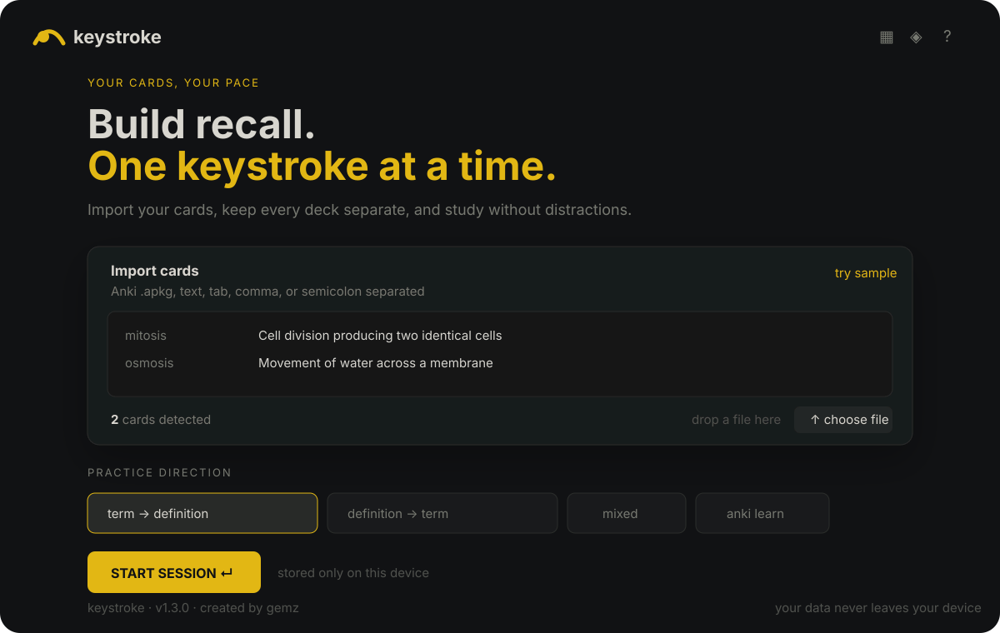
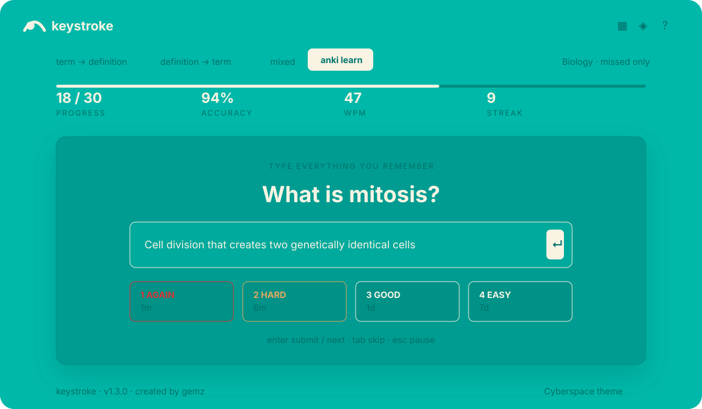

# Keystroke

A keyboard-first study app created by **gemz**.

## Open Keystroke

Use the same link on **Windows, Mac, or Chromebook**:

**https://rubyinsight.github.io/KeyStrokePublic/**

No installation is needed. Open the link in Chrome, Edge, Safari, or Firefox.

## Preview

[](https://rubyinsight.github.io/KeyStrokePublic/)

*Import an Anki deck, choose a practice direction, and start studying.*

[](https://rubyinsight.github.io/KeyStrokePublic/)

*Type what you remember, check your answer, and rate it Again, Hard, Good, or Easy.*

## Start studying

1. Open the link.
2. Drag in an Anki `.apkg` or `.colpkg` file, or choose **choose a file**.
3. Select a deck and study.

Keystroke can also import `.txt`, `.tsv`, and `.csv` files. Both deck packages and full collection packages keep their deck separation and included images.

## Updating a class deck

Leave **update matching decks** selected when your class posts a newer version of a deck, then import the new `.apkg` or `.colpkg` file.

Keystroke matches cards by their stable Anki card ID. It preserves valid study progress, keeps unrelated decks, updates changed text and images, adds new cards, and removes cards no longer included in that matching deck. The result message shows added, updated, unchanged, and removed counts. Reimporting the same package does not create duplicates.

Use **replace entire library** only when the new package should become your complete Keystroke library. Keystroke asks for confirmation before removing the other locally stored decks. Neither option changes the original deck in Anki.

## Daily Learn limits

Choose **anki learn** to set separate daily limits for new cards and due reviews. Use `0` for unlimited. A card counts once per day, while short Again and Hard repetitions stay available so a daily limit does not interrupt a card you already started learning.

## Drag and drop

Drag one `.apkg`, `.colpkg`, `.txt`, `.tsv`, or `.csv` file anywhere onto the Keystroke page. The same import also works with **choose a file**, which is usually easier on phones and tablets.

Import one file at a time and wait for the success message before starting a session or importing another file.

## Make simple cards now

You do not need Anki for basic cards. Paste one card per line into the large **Import cards** box. Separate the term and definition with a semicolon:

```text
mitosis;Cell division producing two genetically identical cells
osmosis;Movement of water across a membrane
```

Keystroke shows the number of detected cards automatically. Choose a practice direction and press **start session**.

Tabs and CSV are also supported. For a larger set, place terms in the first spreadsheet column and definitions in the second, then copy and paste the cells into Keystroke. A dedicated one-card-at-a-time creator is planned for a future update.

## How images work

Use an Anki `.apkg` or `.colpkg` file when cards contain images:

1. In Anki, choose **File → Export**.
2. Select **Anki Deck Package (`.apkg`)** for one deck, or **Anki Collection Package (`.colpkg`)** for an entire collection.
3. Turn on **Include media**.
4. Drag the exported file onto Keystroke or use **choose a file**.

Keystroke preserves images referenced by generated Anki cards. PNG, JPEG, GIF, WebP, AVIF, and BMP images up to 50 MB each are supported. Unsupported, missing, or oversized images are skipped and reported after import.

Every generated Anki database card is imported. Each cloze deletion becomes its own typing prompt. Image-occlusion cards follow Anki's Hide All, Guess One and Hide One, Guess One behavior. During review, use **hide masks** / **show masks** or press **M**. Use **expand image** or press **E** to open a larger view and zoom from 50% to 300%.

Images are copied into private browser storage on that device. They are never uploaded to GitHub or a Keystroke server. Use `.apkg` or `.colpkg` when an exact match to Anki's generated cards matters. Plain-text, TSV, and CSV exports do not contain Anki's card table or media files, so they can preserve study text but cannot guarantee the same generated image-occlusion set.

Keep the original `.apkg` or `.colpkg` file. Clearing browser data can remove stored cards and images, and a Keystroke progress backup contains schedules and statistics, not card text or media.

## Privacy

Cards, images, schedules, and progress stay in that person's browser. They are not uploaded to this repository or sent to a server.

Each student should keep the original Anki file and occasionally use **Export backup** for their progress. Clearing browser data can remove the browser's saved copy.

## Mac application

The website works on Mac without installing anything. Students who receive the separate Mac app can unzip it, drag **Keystroke.app** into **Applications**, and open it. If macOS blocks the first launch, right-click the app and choose **Open**.

## Sharing

Share the website link above with classmates. This repository contains only the Keystroke app, not anyone's decks or study history. Search engines are asked not to index the site, but anyone who receives the link can open it.
